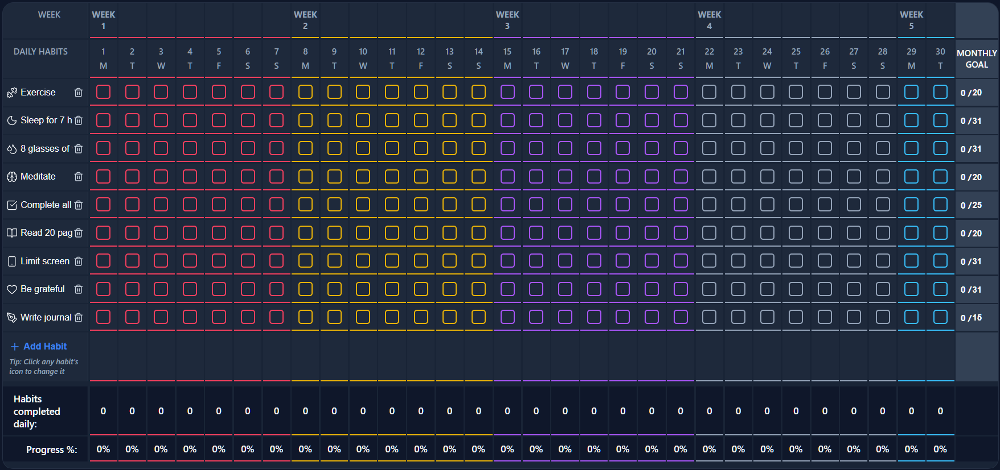
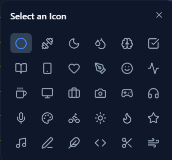
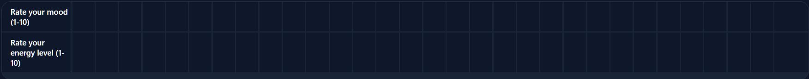

# 🌟 GiggleGrid


A beautiful, modern, and highly interactive, completely **vibecoded** app **Habit Tracker App** called **GiggleGrid**, built with React, Vite, and Electron. Track your daily routines, monitor your mood, and visualize your progress with stunning analytics!

<p align="center">
  
</p>

## ✨ Features

- **✅ Daily Habit Tracking:** Easily check off your habits on a beautifully color-coded, week-by-week grid.
- **🎨 Custom Habit Icons:** Choose from a wide variety of preset icons to personalize each habit.
- **📈 Advanced Analytics:** Visualized progress through dynamic Recharts-powered graphs. See daily completions and monthly goals at a glance.
- **🌗 Dark Mode Support:** Seamlessly toggle between light and dark modes with a beautiful, fully integrated UI.
- **🧠 Mood Tracker:** Log your daily mood alongside your habits for deeper insights into your well-being.
- **💻 Desktop App:** Bundled as a standalone Electron executable for a native desktop experience.
- **✨ Glassmorphism UI:** Features a sleek, modern, frosted-glass design interface.

---

## 📸 Screenshots

### The Habit Grid & Tracking Table
<p align="center">
  
</p>

### Custom Icon Picker Modal
<p align="center">
  
</p>

### Daily Mood Tracker
<p align="center">
  
</p>

---

## 🚀 Getting Started

### Prerequisites
Make sure you have [Node.js](https://nodejs.org/) installed on your machine.

### Installation

1. **Clone the repository:**
   ```bash
   git clone https://github.com/yourusername/gigglegrid.git
   cd gigglegrid
   ```

2. **Install dependencies:**
   ```bash
   npm install
   ```

3. **Start the Development Server:**
   ```bash
   npm run dev
   ```

4. **Build the Desktop Application (Electron):**
   ```bash
   npm run electron:build
   ```
   *Your compiled `.exe` (or `.dmg`/`.AppImage`) will be available in the `dist_electron/win-unpacked` folder.*

---

## 🛠️ Built With

- **[React](https://reactjs.org/)** - UI Framework
- **[Vite](https://vitejs.dev/)** - Next Generation Frontend Tooling
- **[Electron](https://www.electronjs.org/)** - Desktop App Framework
- **[Recharts](https://recharts.org/)** - Charting & Analytics
- **[Lucide React](https://lucide.dev/)** - Beautiful SVG Icons

---

## 🤝 Contributing
Contributions, issues, and feature requests are welcome!

## 🏷️ Tags / Topics
*(Add these to your GitHub Repository "About" section topics to boost popularity!)*

`react`, `electron`, `habit-tracker`, `productivity`, `vite`, `recharts`, `dark-mode`, `desktop-app`, `glassmorphism`, `ui-design`, `self-improvement`, `javascript`

---

*Made with ❤️ to help build better daily habits.*